Scanner codes cheat sheet. Here are a few things we typically do for a Salesforce event. The full manual is in the assets folder.

1. Factory reset
2. Enable URL scanning on
3. Turn sound on LOW
4. I would test your setup but 750ms seems to work well

 

 
 

Reset to Factory Default Settings
 

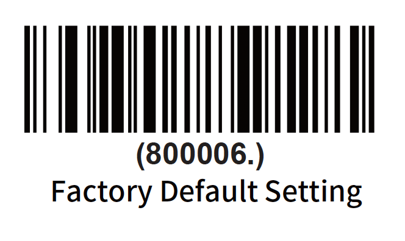
 
 

Turn off buzzer / beep on scan
 

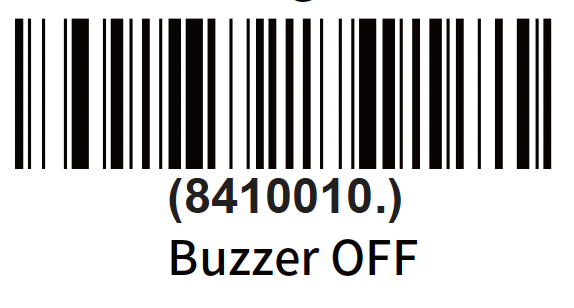
 
 

Turn on buzzer / beep on scan
 

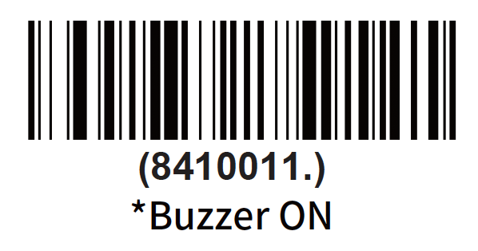
 
 

Buzzer / Beep Volume Low
 

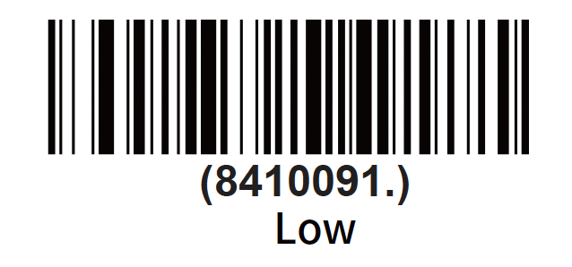
 
 

Buzzer / Beep Volume Medium
 

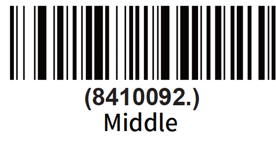
 
 

Buzzer / Beep Volume High
 

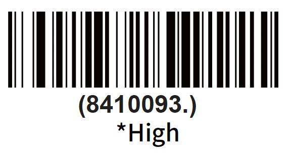
 
 

750ms between scan
 

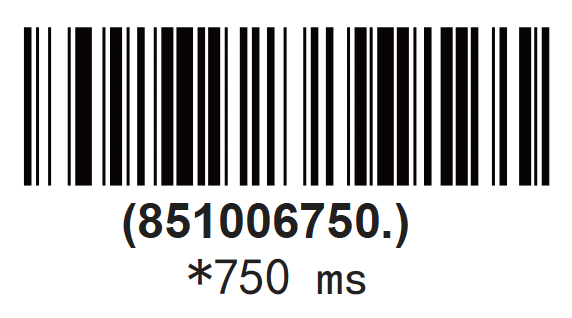
 
 

1000ms between scan
 

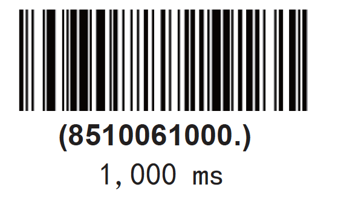
 
 

1500ms between scans
 

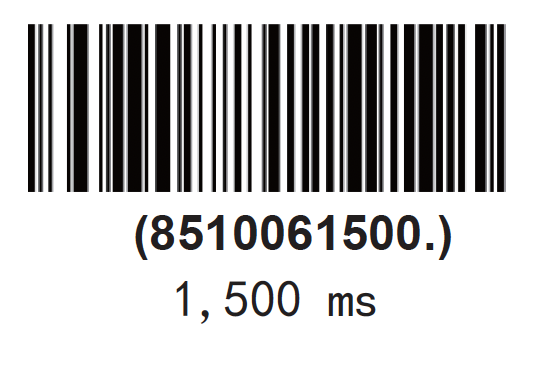
 
 

QR Code URL Scanning On
 

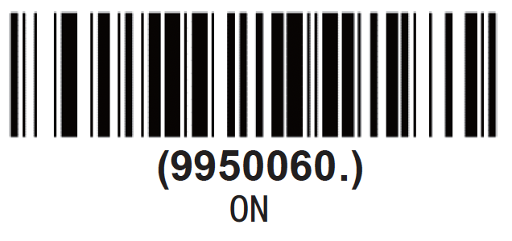
 
 
QR Code URL Scanning Off
 

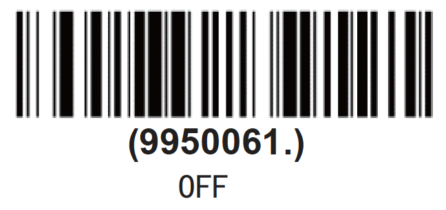
 
 
